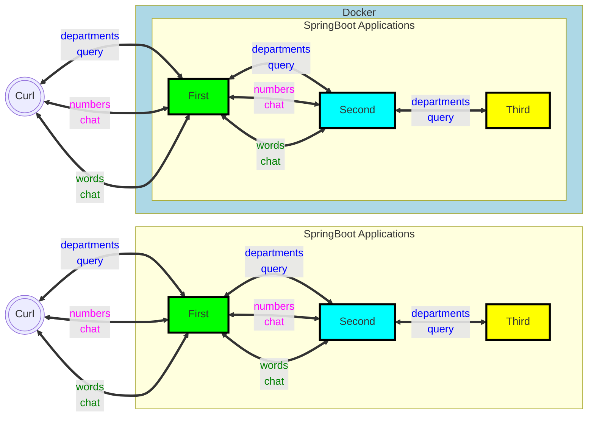

```mermaid
flowchart LR
    CURL1(((Curl)))
    CURL2(((Curl)))
    subgraph SpringBoot Applications
        L-FST[First]:::greenBox
        L-SND[Second]:::cyanBox
        L-TRD[Third]:::yellowBox
    end
    subgraph Docker
        subgraph SpringBoot Applications
            D-FST[First]:::greenBox
            D-SND[Second]:::cyanBox
            D-TRD[Third]:::yellowBox
        end
    end
    class Docker lightBlueBox
%% Flows
    CURL1 <== departments<br>query ==> D-FST
    CURL1 <== numbers<br>chat ==> D-FST
    CURL1 <== words<br>chat ==> D-FST
    D-FST <== departments<br>query ==> D-SND
    D-FST <== numbers<br>chat ==> D-SND
    D-FST <== words<br>chat ==> D-SND
    D-SND <== departments<br>query ==> D-TRD
    CURL2 <== departments<br>query ==> L-FST
    CURL2 <== numbers<br>chat ==> L-FST
    CURL2 <== words<br>chat ==> L-FST
    L-FST <== departments<br>query ==> L-SND
    L-FST <== numbers<br>chat ==> L-SND
    L-FST <== words<br>chat ==> L-SND
    L-SND <== departments<br>query ==> L-TRD
%% Style Definitions
    linkStyle 0,3,6,7,10,13 color: blue;
    linkStyle 1,4,8,11 color: magenta;
    linkStyle 2,5,9,12 color: green;
    classDef greenBox fill: #00ff00, stroke: #000, stroke-width: 3px
    classDef cyanBox fill: #00ffff, stroke: #000, stroke-width: 3px
    classDef yellowBox fill: #ffff00, stroke: #000, stroke-width: 3px
    classDef orangeBox fill: #ffa500, stroke: #000, stroke-width: 3px
    classDef lightBlueBox  fill: lightblue
```