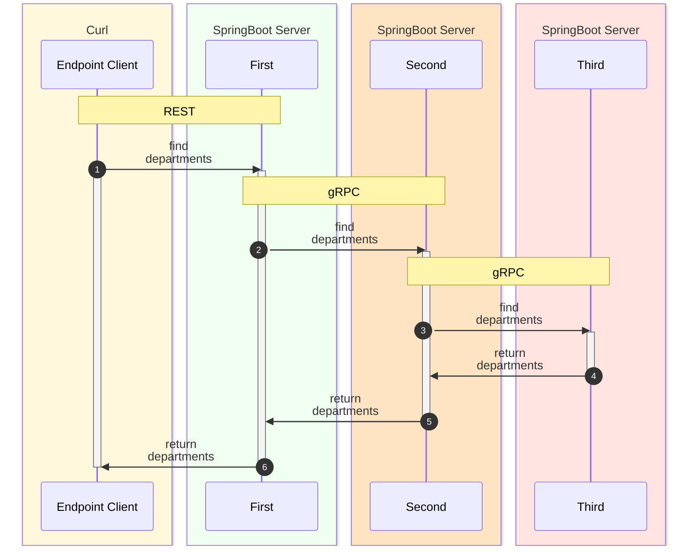
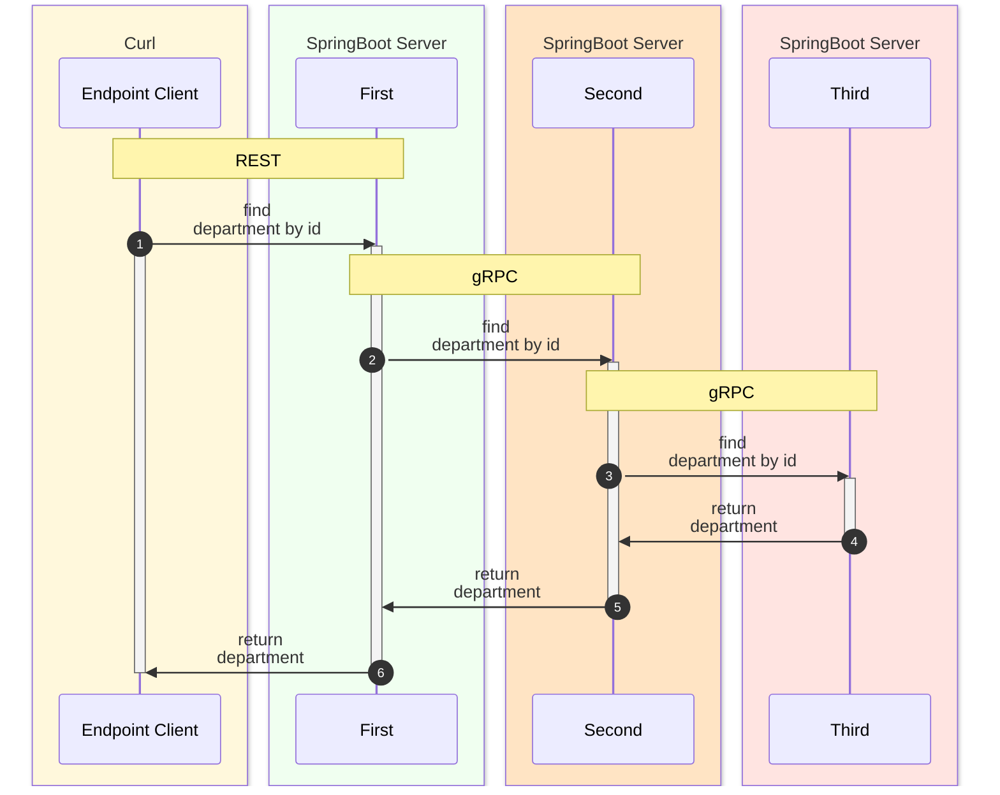
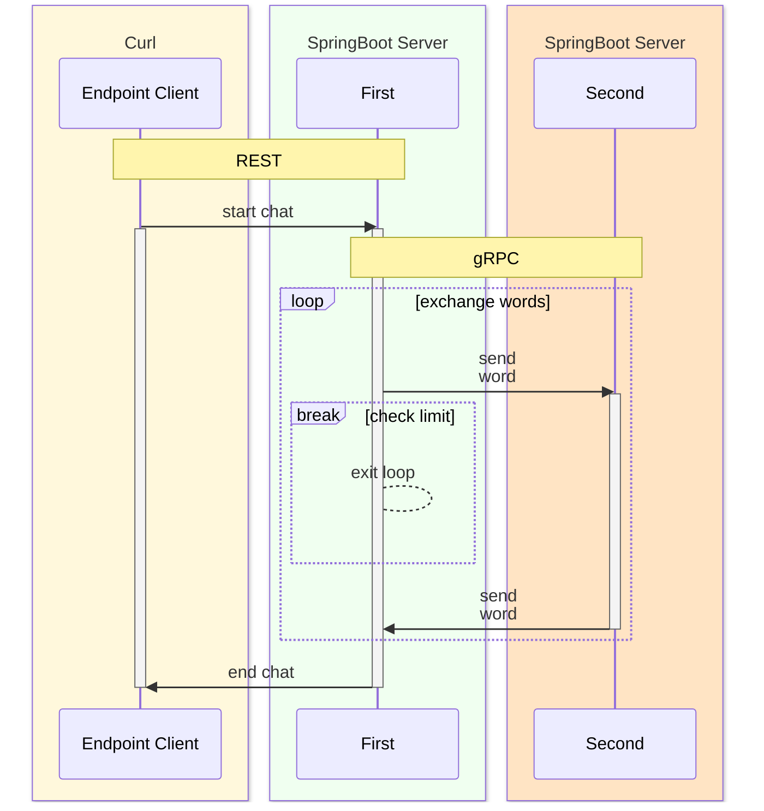
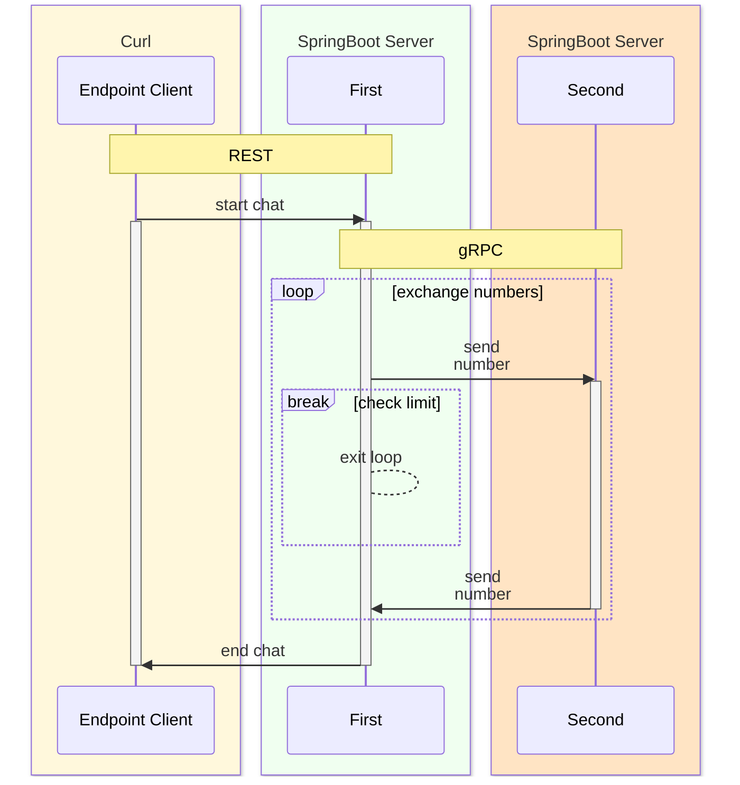

```mermaid
sequenceDiagram
    autonumber
    box cornsilk <br>Curl
        participant CURL as Endpoint Client
    end
    box honeydew <br>SpringBoot Server
        participant FST as First
    end
    box bisque <br>SpringBoot Server
        participant SND as Second
    end
    box mistyrose <br>SpringBoot Server
        participant TRD as Third
    end

    Note over CURL,FST: REST
    CURL ->> FST: find<br>departments
    activate CURL
    activate FST
    Note over FST,SND: gRPC
    FST ->> SND: find<br>departments
    activate SND
    Note over SND,TRD: gRPC
    SND ->> TRD: find<br>departments
    activate TRD
    TRD ->> SND: return<br>departments
    deactivate TRD
    SND ->> FST: return<br>departments
    deactivate SND
    FST ->> CURL: return<br>departments
    deactivate FST
    deactivate CURL
```

```mermaid
sequenceDiagram
    autonumber
    box cornsilk <br>Curl
        participant CURL as Endpoint Client
    end
    box honeydew <br>SpringBoot Server
        participant FST as First
    end
    box bisque <br>SpringBoot Server
        participant SND as Second
    end
    box mistyrose <br>SpringBoot Server
        participant TRD as Third
    end

    Note over CURL,FST: REST
    CURL ->> FST: find<br>department by id
    activate CURL
    activate FST
    Note over FST,SND: gRPC
    FST ->> SND: find<br>department by id
    activate SND
    Note over SND,TRD: gRPC
    SND ->> TRD: find<br>department by id
    activate TRD
    TRD ->> SND: return<br>department
    deactivate TRD
    SND ->> FST: return<br>department
    deactivate SND
    FST ->> CURL: return<br>department
    deactivate FST
    deactivate CURL
```

```mermaid
sequenceDiagram
    box cornsilk <br>Curl
        participant CURL as Endpoint Client
    end
    box honeydew <br>SpringBoot Server
        participant FST as First
    end
    box bisque <br>SpringBoot Server
        participant SND as Second
    end

    Note over CURL,FST: REST
    CURL ->> FST: start chat
    activate CURL
    activate FST
    Note over FST,SND: gRPC
    loop exchange words
        FST ->> SND: send<br>word
        activate SND
        break check limit
            FST --> FST: exit loop
        end
        SND ->> FST: send<br>word
        deactivate SND
    end
    FST ->> CURL: end chat
    deactivate FST
    deactivate CURL
```

```mermaid
sequenceDiagram
    box cornsilk <br>Curl
        participant CURL as Endpoint Client
    end
    box honeydew <br>SpringBoot Server
        participant FST as First
    end
    box bisque <br>SpringBoot Server
        participant SND as Second
    end

    Note over CURL,FST: REST
    CURL ->> FST: start chat
    activate CURL
    activate FST
    Note over FST,SND: gRPC
    loop exchange numbers
        FST ->> SND: send<br>number
        activate SND
        break check limit
            FST --> FST: exit loop
        end
        SND ->> FST: send<br>number
        deactivate SND
    end
    FST ->> CURL: end chat
    deactivate FST
    deactivate CURL
```